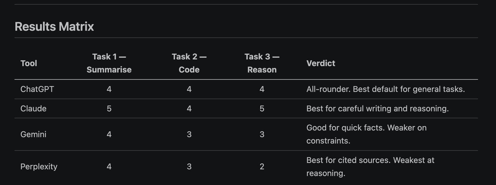

# ai-mentor-portfolio - Vasanth Yenuganti 
Public portfolio of 12-day AI Trainer Workshop. By Day 12: 6 daily notebooks + capstone Streamlit URL.
# Day 1 — Setup complete

- ✅ Google AI Studio API key provisioned
- ✅ Groq API key provisioned
- ✅ Hello-Gemini call working — see [Day1_Setup.ipynb](Day1_Setup.ipynb)
- 4-tool comparison matrix from Lab 1A: see screenshot below

The 5-Layer AI Skill Pyramid outlines the essential components for successful and responsible AI development:

*   **Foundational Infrastructure & Data:** The base layer focuses on data collection, cleaning, MLOps, and infrastructure for reliable AI systems.
*   **Model Development & Research:** Building, training, and optimizing machine learning models, from engineering best practices to developing novel algorithms.
*   **Domain Expertise & Application:** Applying AI solutions to specific industry problems, requiring deep knowledge of the target field.
*   **Ethical AI & Responsibility:** The top layer ensures AI systems are fair, transparent, private, and developed responsibly with societal impact in mind.

# Day 2 — Setup complete

- ✅ Skill Extracting form the text file where multiple resumes contains working — see [Day2_ResumeExtractor.ipynb](Day2_ResumeExtractor.ipynb) 

# Day 5 — Résumé Scorer Streamlit

**Live URL:**   https://ai-mentor-portfolio-hxg49uezqlqradiznbwig8.streamlit.app/
**Code:** [Day-5/resume-scorer/app.py](app.py)  
**Acceptance Log:** [Day-5/resume-scorer/acceptance_log.md](acceptance_log.md)

## Tools Used

- Continue.dev
- Gemini 2.5 Flash
- Streamlit
- GitHub
- Streamlit Community Cloud

## Features

- Résumé vs JD fit score
- Rationale
- Missing skills
- Suggestions
- 4-axis score breakdown chart
- Free learning resources for missing skills

## Reflection

- This is an AI-assisted prototype.
- To productionise, I would add better error handling, caching, rate limits, and authentication.
- Continue.dev helped scaffold the UI quickly, but manual review was needed for prompt correctness and deployment fixes.

